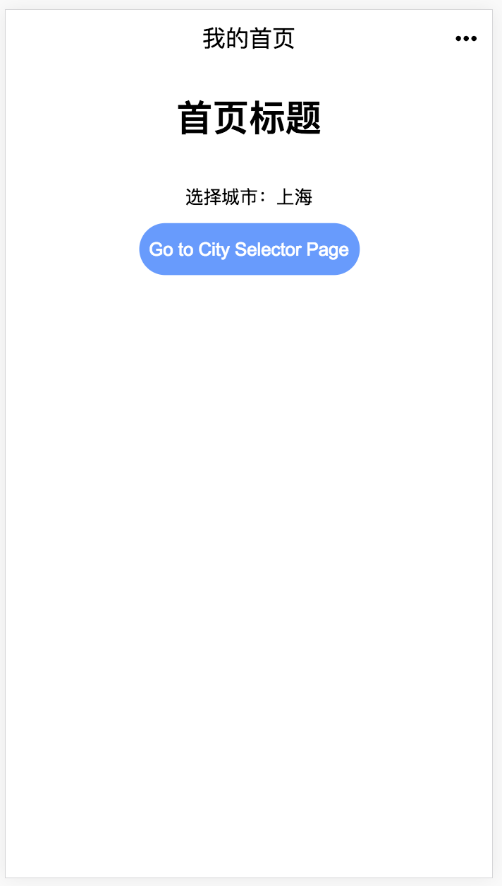

# 初始化全局数据
首页作为常规的入口页面，我们需要先在首页使用 `mip-data` 标签初始化基本的数据，包括我们接下来要使用的全局数据 `city` （城市选择结果）。

## 创建首页
我们首先创建一个页面作为首页，命名为 `index.html`。页面的规范和具体结构我们就不在此重复了，下面我们重点截取数据相关的代码来讲解。

## 数据初始化

```html
<!-- index.html -->
<mip-data>
  <script type="application/json">
    {
      "#city": "上海",
      "title": "我是首页"
    }
  </script>
</mip-data>
```

我们首先用 `mip-data` 初始化了一个数据，数据包含 `city` 字段，默认值为上海。这个数据的特殊之处在于，初始化时，字段前面带有 `#` 标识。带此标识的数据就是全局数据，可以在 MIP 站点内各页面访问到。

而数据中的另一个字段 title，因为没有使用 `#` 声明为全局数据，它仅为页面数据，仅能在首页访问到。

## 数据绑定
```html
<h1 m-text="title"></h1>
<p>选择城市：<span m-text="city"></span></p>
```
我们使用 `m-text` 指令将数据 title 和 city 绑定到 DOM 上，用于展示，这样当数据发生变化时，我们可以通过页面的变化来实时感知到。

绑定全局数据 `city` 时，无需加上 `#` 标识，只需要如同绑定普通页面数据一般即可。

## 页面效果
