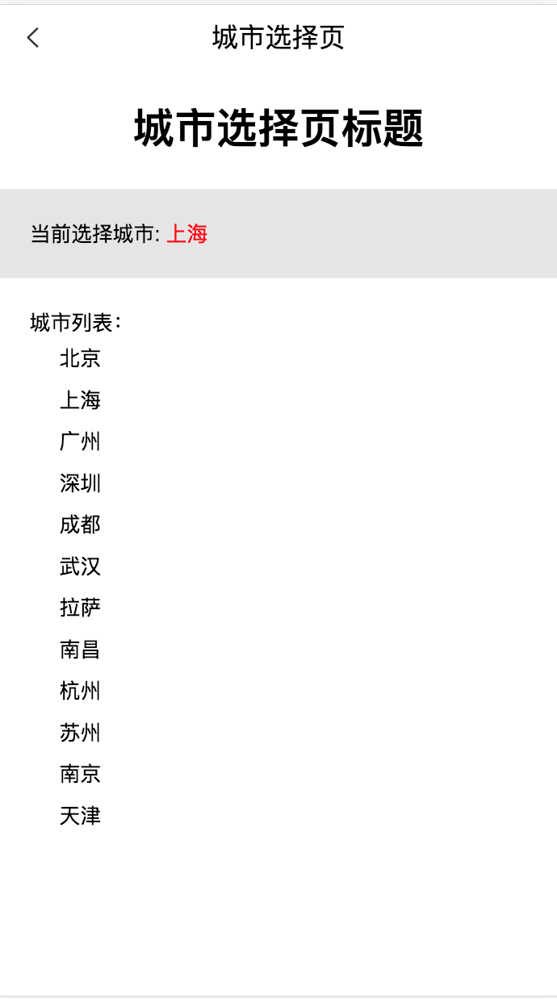

# 在其他页面使用和修改全局数据
在使用首页的全局数据之前，我们需要再创建一个页面。只有拥有两个页面，页面间数据共享才有意义。

## 创建第二个页面
我们再创建第二个页面 - 城市选择页，将这个页面命名为 city-selector.html。在这个页面里，我们会使用到在首页定义的全局数据 `city`，以及通过在组件中写 JS 代码来修改全局数据 `city`。

同样地，下面我们仅展示数据相关的页面代码作为参考：

city-selector.html
```html
<mip-data>
  <script type="application/json">
    {
      "title": "城市选择页标题"
    }
  </script>
</mip-data>
<p class="city">当前选择城市: <span m-text="city"></span></p>
<mip-city-list>
  <script type="application/json">
    {
      "list": [
        "北京",
        "上海",
        "广州",
        "深圳",
        "成都",
        "武汉",
        "拉萨",
        "南昌",
        "杭州",
        "苏州",
        "南京",
        "天津"
      ]
    }
  </script>
</mip-city-list>
```

在 city-selector.html 中，我们通过 `mip-data` 标签仅定义了当前页面的标题数据 `title`，并没有定义 `city`。这是因为 `city` 在首页已经作为全局数据定义过了，从首页跳转到城市选择页后，该数据可以直接使用。

## 创建组件
从 HTML 的代码还可以看到，我们使用了一个叫 `mip-city-list` 的自定义组件，这是为了方便展示和操作城市列表，开发者可以参考以下代码创建组件，并把编译后的组件代码文件链接到 city-selector.html 中。

mip-city-list.vue
```html
<template>
  <div class="mip-city-list-wrapper">
    <p class="sub-header">城市列表：</p>
    <ul>
      <li 
        v-for="(item, i) in list"
        @click="select(i)">{{item}}</li>
    </ul>
  </div>
</template>

<script>
export default {
  props: {
    list: {
      default: () => [],
      type: Array
    }
  },
  methods: {
    select (index) {
      MIP.setData({
        city: this.list[index]
      })
    }
  }
}
<script>

<style scoped>
.mip-city-list-wrapper {
  padding: 20px;
}
.mip-city-list-wrapper ul {
  list-style-type: none;
  line-height: 28px;
  margin-left: 20px;
}
</style>
```

在组件中，我们展示了城市列表，并允许用户点击城市列表的每一个 item，点击选择后会将全局数据 `city` 通过 `MIP.setData` API修改为选中的城市结果。

修改全局数据时需要区分若干种情况，详情请阅读 [可交互 MIP - 全局共享数据](https://mip-project.github.io/guide/interactive-mip/global-data.html#修改共享数据)。上面的示例代码中是其中 `MIP 自动判断` 的情况。

## 页面效果


## 操作全局数据
点击选择了默认城市（上海）之外的城市后，可以看到页面上的当前选择城市已经更新。点击页面左上角的返回按钮，回到首页，你将发现，首页的城市数据也更新为选择后的城市。