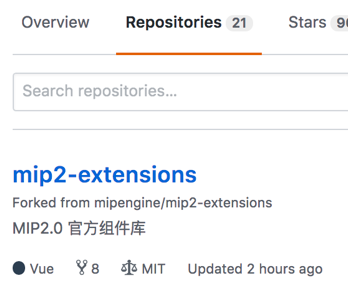
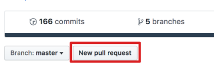
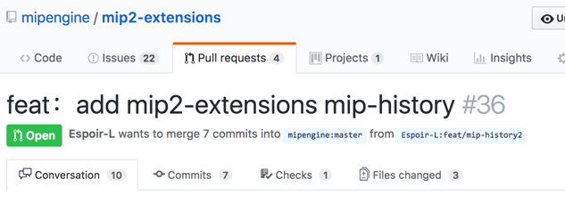

# 如何贡献官方组件代码

官方组件是官方提供的较为通用的组件，开发者也可以通过 Pull Request 的方式修改提交。下面介绍如何提交官方组件。

## 提交组件到官方组件仓库

当前 MIP 的官方组件在[Github](https://github.com/mipengine/mip2-extensions)上托管，开发者可以通过提交 Pull Request 的方式来贡献优秀的组件。

### 步骤

1.**fork 官方组件仓库**

首先，浏览器进入 GitHub 中 MIP 官方组件代码仓库：`https://github.com/mipengine/mip2-extensions`。点击右上角的 fork 按钮，如下图所示，如果你认为 MIP 项目做得还不错，欢迎为MIP项目贡献 star。


fork 完成后，在你 GitHub 主页下的 Repositories 下会多出一个 mip2-extensions 仓库，如下图：



将仓库 `clone` 到本地

```bash
$ git clone https://github.com/your-username/mip2-extensions.git
```

2.**开发**

`git clone` 出来的项目结构与 `mip2 init` 命令初始化的项目结构类似，我们可以在根目录使用 `mip2 add` 命令新增组件。


根据 `mip2 add` 的命令提示，我们可以通过以下命令来增加一个叫 `mip-example` 的组件开发目录：

```shell
mip2 add mip-example
```

然后在新增的组件开发目录里根据相关开发文档的教程进行组件开发调试与校验：

- [组件开发](../development/component-syntax.md)
- [调试](../debug/mip-dev.md)
- [校验](./mip-cli-usage.md#组件和页面校验)

开发完成后提交：

```bash
# add需要提交的文件
$ git add .
# commit需要提交的文件
$ git commit -m 'update_log...'
# pull 保持和远程分支一致
$ git remote add upstream https://github.com/mipengine/mip2-extensions.git
$ git pull upstream master
# push 本次提交
$ git push
```

3.**发起 Pull Request**

开发完成后，[发起 pull Request](https://help.github.com/articles/creating-a-pull-request-from-a-fork/)

进入自己 fork 的仓库，点击 New pull request 按钮:



按照提示，完成提交。最终会在官方仓库提交一个 Pull Request



Pull Request 提交后，会自动触发持续集成的任务，如代码规范检查、部署预览等，在 Conversation 选项卡可以看到实时状态。如果有不通过的，需要再次修改提交，确保所有检查项都成功通过，官方才能审核合入。


4.**官方审核通过，合入上线**

官方开发人员操作合入之后，代码最终 merge 到官方库，在此过程中可关注官方开发人员的评论，积极参与讨论，共同为 MIP 组件贡献良好的代码。

5.**调用组件脚本**

```
// 页面中引用
<script src="https://c.mipcdn.com/static/v2/mip-example/mip-example.js"></script>
```
