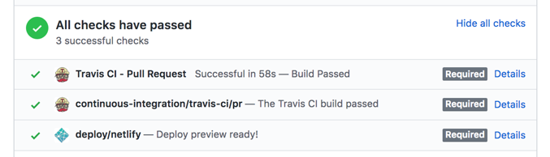

# 如何提交站长组件代码

[notice]站长组件是扩展 MIP 功能的一种形式，在开发提交站长组件之前，请首先阅读[《请优先使用 MIP 现有机制和官方组件来实现业务功能》](./use-official-mip-first.md)一文，看看所需要开发的站长组件是否已被 MIP 现有的机制和官方组件覆盖了，从而减少开发和审核的时间成本。

当前 MIP 的组件有内置组件、官方组件、站长组件几部分。其中，内置组件不支持开发者提交修改，官方组件是官方提供的较为通用的组件，开发者也可以通过 Pull Request 的方式[修改提交官方组件](./how-to-contribute-mip-extensions.md)。站长组件则是为了满足站点特殊定制化需求而提供的。下面介绍如何提交站长组件。

## 提交站长组件

### 站长组件仓库说明

与 MIP 1.0 采用的方式不同，MIP 2.0 以项目（一个站点）的粒度来管理站长组件。每一个项目（使用 `mip2 init` 命令生成）中包含了这个站点所需的所有自定义组件。

MIP 2.0 的站长组件托管在 [Github 站长组件仓库](https://github.com/mipengine/mip2-extensions-platform)，项目结构大致如下：

```bash
├──sites
    ├── test.a.com
    │   ├── common
    │   ├── components
    │   ├── example
    │   ├── mip.config.js
    │   ├── node_modules
    │   ├── package-lock.json
    │   ├── package.json
    │   └── static
    └── test.b.com
        ├── common
        ├── components
        ├── example
        ├── mip.config.js
        ├── package-lock.json
        ├── package.json
        └── static
├── LICENSE
└── README.md

```

`sites` 目录即是站点项目的集合。示例中已经托管了 `test.a.com` 和 `test.b.com` 两个站点的自定义组件。站长各自在其 `components` 目录下[编写组件](../development/component-syntax.md)。

本地需求实现并测试无误后，通过 `Pull Request` 的方式（暂时方案）提交审核，官方通过审核后会定期编译上线。

供站点使用的最终发布地址为：

```bash
https://c.mipcdn.com/extensions/platform/v2/{站点项目名}/{组件名}/{组件名}.js

# 例如 test.a.com 下的 mip-example 组件

https://c.mipcdn.com/extensions/platform/v2/test.a.com/mip-example/mip-example.js
```

### 站长组件开发、提交流程

1.**fork 站长组件仓库**

首先，浏览器进入 GitHub 中 MIP 官方组件代码仓库：`https://github.com/mipengine/mip2-extensions-platform`。点击右上角的 fork 按钮，fork 完成后，在你 GitHub 主页下的 Repositories 下会多出一个 mip2-extensions-platform 仓库。

2.**开发**

我们进入 `sites` 目录，如果是第一次提交一个站点的组件，运行命令

```bash
$ mip2 init
```

按照提示输入项目名称，如 `test.a.com`，新增了一个站点项目。


```bash
$ cd test.a.com
```

切换到站点项目目录即可快速进行组件开发工作了，这块开发的方式与官方组件开发的方式相一致。

3.**发起 Pull Request**

开发完成后，[发起 Pull Request](https://help.github.com/articles/creating-a-pull-request-from-a-fork/)。进入自己 fork 的仓库，点击 New pull request 按钮，按照提示，完成提交。最终会在官方仓库提交一个 Pull request。Pull request 提交后，会自动触发持续集成的任务，如代码规范检查、部署预览等，在 Conversation 选项卡可以看到实时状态。如果有不通过的，需要再次修改提交，确保所有检查项都成功通过，官方才能审核合入。



在提 PR 的时候，需要注意以下事项：

1. 每个 PR 的代码只能针对单个组件进行新增或修改，不建议一次性提交多个组件的改动，以避免其中的部分组件因审核没通过而导致整体被打回；
2. 每个 PR 必须写明开发理由，尤其是说明 MIP 现有机制和官方组件为何不能覆盖开发需求；
3. 同时 PR 必须写明本次代码提交的相关改动说明，比如修复了什么问题、新增了什么功能；

下面是一个简单的 PR 说明示例：

```md
# 新增 mip-example 组件

## 开发理由

目前项目存在如下需求： XXXXXX，这个功能无法通过 MIP 现有机制实现，因此需要开发 mip-example 来实现相关功能。

## 组件说明

新增 mip-example 组件，实现如下功能：

1. xxxx
2. xxxx
3. xxxx
```

MIP 官方将严格按照以下原则进行组件审核，不符合要求的 Pull Request 将会打回要求修改，或者直接关闭 PR：

- 组件功能能够直接通过 MIP 现有机制和 MIP 官方组件实现的，此类组件没有意义，将会直接打回；
- 组件不满足[《MIP 组件开发规范》](./component-spec.md)的要求的，此类组件不规范，将会直接打回；
- Pull Request 和 组件 REAME.md 不清晰导致审核人员无法理解组件的功能、用法的，会直接打回或要求补全相关文档。README.md 文档翔实度请参考官方组件；
- 审核人员给出审核意见但不进行修复，也不进行回复说明的，预期 1 个月 PR 无更新则直接 close PR。

[info] 最常见的一类站长组件是，前端发 AJAX 请求接口数据之后，在前端进行数据处理和 HTML 模板拼接，这种类型的组件可以直接使用 MIP 提供的[数据驱动与模板渲染](../../docs/interactive-mip/data-driven-and-dom-render.md)机制直接实现，无需额外进行站长组件提交，这类站长组件基本都会被直接打回。

4.**官方审核通过，合入上线**

官方审核通过后，代码将合入 `master` 分支并上线。若不通过，请根据反馈修改后再次提交。

5.**调用组件脚本**

```
// 页面中引用
<script src="https://c.mipcdn.com/extensions/platform/v2/{站点项目名}/{组件名}/{组件名}.js"></script>
```
