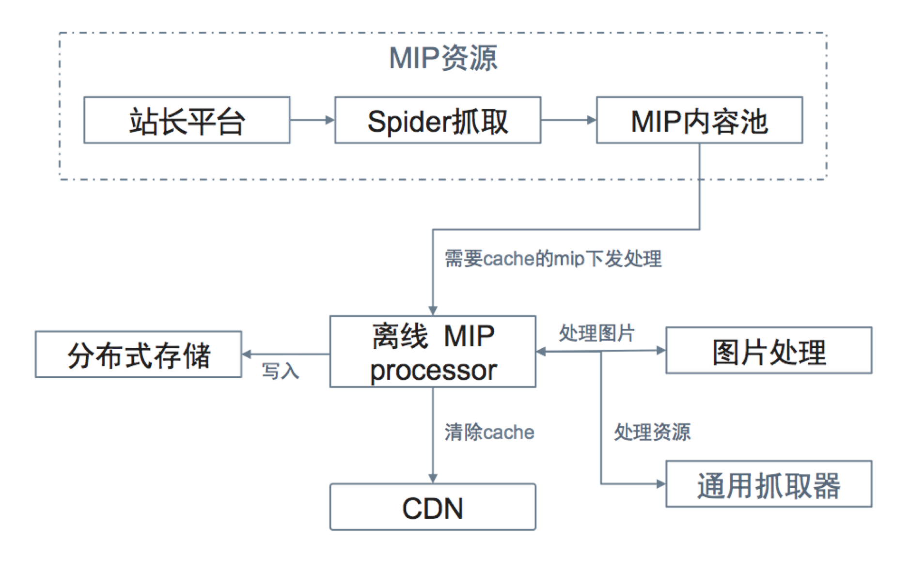
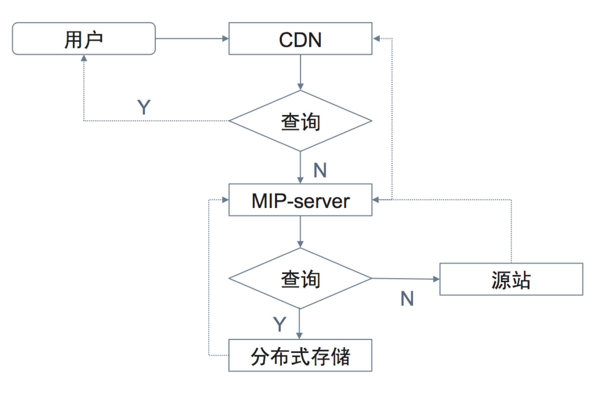

# MIP-Cache

MIP-Cache 给所有符合规范的 MIP 页面提供缓存服务，相当于一层 CDN。无论是页面还是图片，都会被缓存，并从 MIP-Cache 直接返回。在本节中，将会讲到资源在 MIP-Cache 的生效流程，MIP-Cache 的通用规范，以及百度的实现方案。

## MIP-Cache 生效流程

由于全网的 MIP URL 数量过大，做到每条 URL 都缓存不现实。优先缓存高点击 URL，直接返回长尾 URL 是一个合理的策略。
对于已离线缓存的 URL，采用离线流程，直接从处理好的 MIP-Processor 中获取数据，返回给用户。离线流程下图所示。



对于未缓存的URL，MIP-Cache采用在线流程，优先抓取源站返回。在线流程如下图所示。



## MIP-Cache 通用规范

### MIP-Cache URL 规范

MIP-Cache 给所有符合规范的 MIP 页面提供 Cache 服务，能够主动地提高页面加载速度，为使用 MIP-Cache 服务的页面上的图片、CSS 文件等资源提供缓存服务，这样能做到所有  HTTP 请求来自于同源，能够加速加载速度。URL的具体规则和下列情况有关。

- 内容类型：图片使用 `/i`；MIP HTML document 使用 `/c`；其他资源使用 `/r`，如 tff 文件。
- 协议类型：使用 TLS，https 的增加 `/s`，http 的不加。

#### 网页地址

https 资源：

- originalUrl：https://www.xx.com/
- cdnMipUrl：https://MIP-CacheHost/c/s/www.xx.com

http 资源：

- originalUrl：http://www.xx.com/
- cdnMipUrl：https://MIP-CacheHost/c/www.xx.com

#### 图片

https 资源：

- originalUrl：https://www.xx.com/a.jpg
- cdnMipUrl：https://MIP-CacheHost/i/s/www.xx.com/a.jpg

http 资源：

- originalUrl：http://www.xx.com/a.jpg
- cdnMipUrl：https://MIP-CacheHost/i/www.xx.com/a.jpg

#### 资源

https 资源：

- originalUrl：https://www.xx.com/b.tff
- cdnMipUrl：https://MIP-CacheHost/r/s/www.xx.com/b.tff

http 资源：

- originalUrl：http://www.xx.com/b.tff
- cdnMipUrl：https://MIP-CacheHost/r/www.xx.com/b.tff

### HTTPS 代理

处于安全性考虑，HTTPS 的资源不会被劫持。MIP-Cache 对所有资源进行 HTTPS 代理，能够保证网页开发者和使用者的权益。

### MIP-Cache 的更新和删除机制

由于 MIP-Cache 会保存一份页面的快照，但对应的页面可能升级或删除。因此，需要提供自动更新，手动更新和手动删除机制。

#### MIP-Cache 遵循异步更新策略

当用户访问 MIP-Cache 时，倘若页面在 MIP-Cache 中不存在，MIP-Cache 会尝试抓取网页，按照页面处理的规则处理并缓存网页，然后给用户返回。倘若页面在 MIP-Cache 中已经存在，只要页面还不是特别「不新鲜」，MIP-Cache 会首先把页面返回给用户，以保证用户能以最快的速度打开页面；同时 MIP-Cache 会发起一个异步抓取的流程，负责将页面抓取回来，按照页面的处理流程处理页面并分门别类地存储页面中的数据，以保证后续访问的用户能看到一个相对「新鲜」的页面。

#### 更新和删除页面的步骤

站长如果想更新和删除 MIP-Cache 缓存的页面需要两步。首先，站长处理好页面，更新需求即更新网页内容，删除即让网页不可用。然后站长调用 MIP-Cache 的接口更新和删除网页缓存。

### MIP-Cache 的 Validator

由于 MIP-Cache 是专门为 MIP 页面服务的 Cache，因此 MIP-Cache 内置了 MIP 页面的校验功能，总体上遵循的逻辑如下。

- MIP-Cache 抓取页面。
- 抓取成功后的 HTML 内容发给校验模块。
- 如果页面是 MIP 页面，则继续 MIP-Cache 后续的服务逻辑。
- 如果页面不是 MIP 页面，则 MIP-Cache 终止本次服务，并返回状态码 404。

## 百度 MIP-Cache 的附加功能

为了让站长的域名更多地露出，MIP-Cache 支持通过独立二级域名的方式访问；为了在 Cache 的命中率和页面更新周期之内做权衡，MIP-Cache 整体上遵循异步更新的策略；此外，MIP-Cache 内置了 MIP 的 Validator 检查器，不符合规范的页面不会被 MIP-Cache 缓存；MIP-Cache 本身的高频更新，也可以快速发现站长站点的问题，及时将故障信息反馈给站长。

### 独立二级域名

百度 MIP-Cache 的独立二级域名支持的目的是解决两个问题。

1. 让站长的域名更多地露出；
2. 解决多个站点复用一个域名，Cookie 大小不可控的问题。

MIP-Cache 域名替换规范如下:

- 站点域名中的 `.` 将被替换为 `-`
- 站点域名中的 `-` 将被替换为 `--`
- 上述规则执行完后，拼接上 MIP-Cache 的域名 `.mipcdn.com`
- 由于 MIP-Cache 的域名替换规则比较复杂，再后文中统一称之为 `MIP-CacheHost`。举个例子：`www.xx.com` 将被替换为 `www-xx-com.mipcdn.com`

当然，独立二级域名上线之后，会带来比较多的 DNS 解析长尾问题，为此，百度在结果页 load 之时，会对所有 MIP-Cache 的域名做预解析，做到既解决站长的痛点，又不影响用户体验。

在百度搜索结果页中，MIP-Cache 针对以上情况做了容灾，校验失败的页面会跳转到源站。

### 百度 MIP-Cache 页面处理

MIP-Cache 有自己的 HTML 解析器。针对所有页面，MIP-Cache 的页面处理逻辑如下。

- 解析：读取 MIP 页面的 HTML 内容，将 HTML 内容，按照 W3C 的规范，解析为 DOM 树。
- 提链：解析过程中，MIP-Cache 的解析器会根据 MIP-Cache 的缓存规范，提取需要 MIP-Cache 处理的所有链接。
- 改写：根据 MIP-Cache 的 URL 规范，改写页面中所有的静态资源，使之同源。
- 序列化：将改写后的 DOM 树序列化为 HTML 字符串。序列化过程中，会做去掉注释、所有标签闭合、自闭合标签统一改写等让页面更加符合规范的操作。
- 返回：HTML 页面返回给用户，用户开始渲染和展现。
- 抓取：针对页面中提链出来的资源，分发给不同的处理后端处理并缓存。

除此之外，需要补充以下内容:

1. MIP-Cache 处理时间：抓取时间除外，MIP-Cache 的所有页面处理逻辑会在毫秒级别的时间内完成。
2. MIP-Cache 处理的资源： 目前，MIP-Cache 处理的资源，包括但不限于以下几类：图片、字体、CSS。

后续，MIP-Cache 会上线更多可以优化页面打开速度的策略，MIP-Cache 所有的策略更新都会在 MIP 官网上通知给站长，敬请关注。

### 百度 MIP-Cache 的抓取标准

- MIP-Cache 只有在用户点击的时候才会抓取，不会给站长带来比较多的流量上涨；对于高点击的页面，MIP-Cache 会帮源站抗比较多的访问压力。
- MIP-Cache 抓取会带着统一的 UA，UA 为：`Mozilla/5.0 (Linux;u;Android 4.2.2;zh-cn;) AppleWebKit/534.46 (KHTML,like Gecko) Version/5.1 Mobile Safari/10600.6.3 (compatible; baidumib;mip; + https://www.mipengine.org)`。
- 请不要对 MIP-Cache 的抓取 UA 相关的流量做任何封禁操作，否则会带来比较严重的更新和用户体验问题。

### 百度 MIP-Cache 的超时设置

目前 MIP-Cache 的超时时间根据数据的情况有所不同，与 MIP-Cache 的服务器配置也有关系。对页面来说，MIP-Cache 中最快能被更新的时间为 52 分钟，最慢的更新时间为 5 天左右。页面的更新情况与源站的可用性及用户的点击行为强相关。对于图片及静态文件来讲，缓存时间为 10 天。后续，MIP-Cache 会根据访问的数据特征调整这部分更新时间，所有的调整都会在 MIP 官网上通知

## 百度 MIP-Cache 的操作

### 清理 MIP-Cache

如果你在 MIP-Cache 生效期间修改了页面代码，由于 MIP-Cache 未更新，这个改动并不会被百度搜索结果的用户感知到，这个问题可以通过紧急清理MIP-Cache 解决。

紧急清理 MIP-Cache 对频率有限制，每 100s 只能清理 10 次。操作方法以 `百度资源平台` -> `MIP 引入` -> `MIP-Cache 清理`为准，在这里简单演示一下 PHP 方法。

1. 新建 clear.php 文件；
2. 在文件中写入站长平台提供的 PHP 示例；
3. 如果 MIP 页是 https，将第一行 `$api=` 中的 `"/c"` 改为 `"/c/s"`；
4. 修改第二行 `$postData` 内容为页面上方的 Authkey
5. 修改第三行 `$api.urlencode()` 参数为目标 MIP URL；
6. 在终端执行`$ php clear.php` 命令，如果清理成功，则看到返回值如下：

```JSON
{"status":0,"msg":"cache clean success"}
```

### 紧急删除 MIP 页面方法

在删除服务器上的一个 MIP 页面后，由于 MIP-Cache 未过期，搜索用户还是能够访问到页面。这个问题也可以通过紧急清理 MIP-Cache 解决，步骤如下:

1. 从服务器删除页面资源；
2. 紧急清理 MIP-Cache，方法见上节。

> 删除 MIP-Cache 后，MIP-Cache 会通知百度 Spider 重新抓取，评估页面。因此，紧急删除 MIP-Cache 后，百度搜索内部的 MIP 页面展现也会在很较短的时间内消失。

## MIP-Cache 小结

本节内容介绍了 MIP-Cache 的生效流程，从通用的角度给出 MIP-Cache 应该具有的功能：静态文件缓存改写、HTTPS 代理、提供更新机制、更新时校验。接下来解释了百度 MIP-Cache 的功能，除了实现通用机制，还增加了独立二级域名、智能抓取、定时更新等功能。最后演示了使用 MIP-Cache 更新清理接口，方便站长更加灵活地使用 MIP-Cache。
