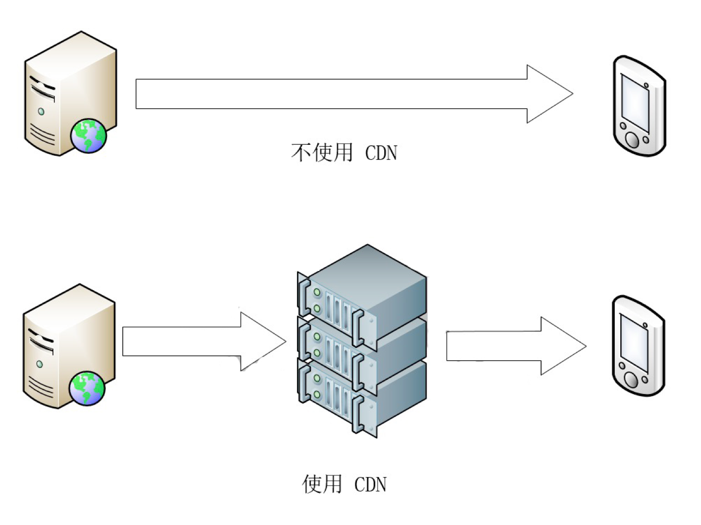
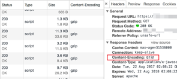
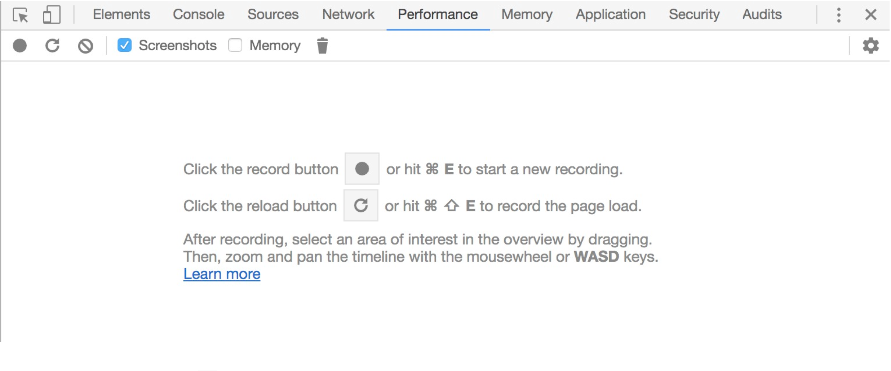
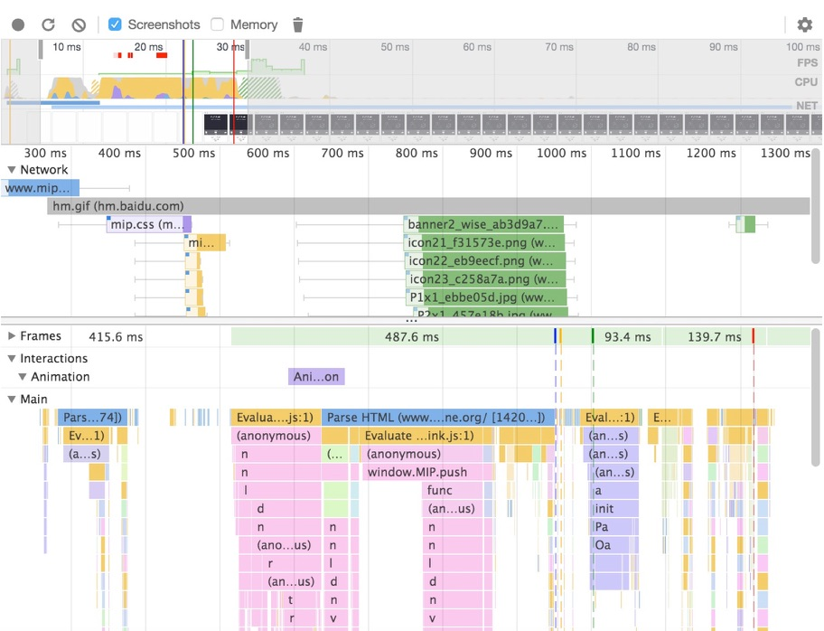
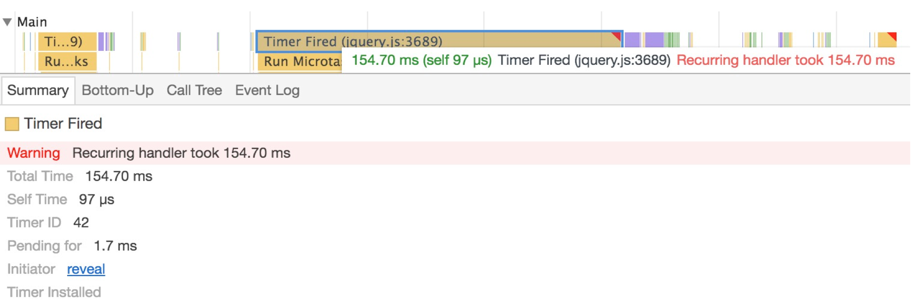

# MIP 加速原理

过去，落后的网络技术是内容提供者在移动端上提供内容的速度瓶颈。随着移动互联网技术的不断发展，用户对速度的需求也越来越高。使用 MIP 技术可以有效地提升内容到达用户的速度，使用户满意度得以显著提升。本节将介绍MIP是如何尽其所能提升页面速度的。

## 移动网页加速的黄金法则

本小节我们将介绍如何提升速度，缩短网页的加载时间，使用户得到最佳的体验。

### 使用 CDN

提高内容下载速度是最显而易见的加速手段，通常而言，使用 CDN（Content Delivery Network，内容分发网络）将内容由离访客尽量近的节点提供，能十分显著地加快下载速度，从而提高网页打开速度。

由于边际成本作用，对于中小型站点，自行搭建 CDN 显然是一件花费巨大而收效甚微的事情；而更合理的方式是选择使用现有的 CDN 服务。例如，CloudFlare 和百度云加速是国际和国内最为著名的两家 CDN 服务提供商，而它们甚至提供免费的 CDN 服务。此外，你还可以选择 Amazon CloudFront、又拍、七牛等 CDN 服务。



通过 CDN 服务，你的内容可以利用尽量大的用户带宽，可以快速地到达用户的终端，在启用 CDN 前，内容从 Web 服务器直接发送到用户终端。而使用了 CDN 之后，Web 服务器预先将资源缓存到分布在全球的 CDN 服务器，然后在用户访问时，再从 CDN 服务器上下载内容。

### 降低传输体积

网页的加载时间等于速度乘以体积，倘若下载速度已经到达瓶颈，降低传输体积亦是十分有效的提速手段。而降低传输体积有数种手段，在此粗略列举如下。

### 使用传输压缩算法

在 HTTP 协议中，浏览器在向服务器请求数据时，会使用 `Accept-Encoding` 声明自己可以解析的传输压缩算法。这些压缩算法包括 gzip、Broti、zlib 等，其中 gzip 在各浏览器中被广泛使用。例如，对于流行的 nginx 服务器软件，只需要在 HTTP 配置块中设置 `gzip on`，即可使其支持这种压缩算法。

如下图所示若正确配置了 gzip，你将可以在响应头中看到 `Content-Encoding: gzip` 的字样，同时该文件传输的数据量大大减小。对于JavaScript 或者 CSS 资源，压缩率通常可达到 50%，十分可观。



### 使用被压缩合适的图片

为图片选择合适的压缩算法，可以有效地减小体积。特别地，在现代浏览器下得到支持的新图片格式通常能为你在相同画质下提供更小的体积。下表显示了不同压缩算法的特性，你可以根据需要选择合适的压缩算法。例如，若不需要透明度通道，可以选择尺寸更小的有损压缩算法 JPEG；又例如你需要使用动画，那么 WebP 可能是 GIF 的一个可选替代。

压缩算法 | 损失质量 | 支持动画 | 透明度通道 | 文件尺寸 | 兼容性
---|---|---|---|---|---
JPEG | 是 | 否 | 无 | 小 | 好
GIF | 是 | 是 | 仅透明色 | 中 | 好
PNG | 否 | 否 | 有 | 大 | 好
APNG | 否 | 是 | 有 | 大 | 差
有损 WebP | 是 | 是 | 有 | 极小 | 极差
无损 WebP | 否 | 是 | 有 | 小 | 极差

在本文档写作时，APNG 仅被 Firefox、Chrome 59+、Safari 和 Opera支持，而 WebP 格式则仅被 Chrome 和 Opera 支持。你可以访问`https://caniuse.com/` 并在搜索框中输入「APNG」或「WebP」来查看最新的浏览器支持率的数据。

### 使用压缩过的源代码

HTML、CSS 和 JavaScript 都可以使用大量成熟的方案来进行压缩，部分 CDN 提供商甚至内建了这些功能。例如，被广泛使用的开源工具 UglifyJS或 Google 发布的 Closure Compiler 在发布之前会处理你的 JavaScript 文件，可以使其体积显著减小。
压缩源代码会使得代码变得不可读，这也能一定程度上保护你的知识产权，但可能对你的调试带来麻烦。为此，压缩工具通常会生成「源代码地图（SourceMap）」(.map文件)，将它加载到浏览器中后，浏览器就能将压缩的代码映射到你的源代码中。

### 使用缓存

若你的用户喜欢你的网站并且时常回来看，或是用户喜欢在你的内容之间跳转，那么缓存技术是你一定要考虑使用的性能杀手锏。缓存使得浏览器能够将资源下载到本地，并在下次访问时直接使用这份副本，以避免多余的网络请求。
另一方面，缓存可能导致用户无法看到最新的网页内容，故设置缓存时，也需要关注缓存的有效性。通常而言，使用 `Cache-Control`、`Etag` 和唯一网址中的任意一种均可以控制缓存的有效性，在此不再展开赘述。

### 正确加载外部文件

作为 Web 标准，若你在 HTML 中插入了 `<script>` 标签，浏览器会阻塞DOM渲染而等待 JavaScript 运行。在该标签上增加 async 属性，可以使其不阻塞 DOM 渲染并将其延迟到下载之后再执行——但这对传统的网站而言，修改脚本的执行时机可能使其不能正常工作，需要针对其进行修改。若无法使用 async 属性，也可以考虑将其放在网页底部，使其尽量不阻塞网页渲染。

若你的网页含有大量的图片，推荐的做法是使用懒加载技术。懒加载是在 HTML 渲染解析中过程中不加载任何资源，然后通过 JavaScript 监听滚动事件在用户浏览过程中加载图片的技术。在 HTML 中使用大量图片，会导致浏览器发起大量请求，影响并发性能的同时阻塞用户带宽，使得重要内容难以被迅速加载。若使用懒加载技术，在用户浏览时才开始请求图片，则会大大降低页面加载所花的时间。

虽然异步下载能提升下载性能，但 CSS 会影响 DOM 渲染的方式。由于异步加载 CSS 不仅会带来页面跳动，更会导致页面重绘使得性能严重下降，所以CSS需要在网页头部的最前端声明，以尽早地下载、解析。

### 优化 JavaScript 性能

现今网页中 JavaScript 必不可少，使用高性能的 JavaScript 脚本也是提升性能的重要环节。例如，尽量避免大量使用会导致页面重绘、回流的 DOM 操作，或是使用缓存避免频繁访问 DOM 等。
诚然，移动网页加速是一门十分复杂的学问，笔者在此列出的数种常见方法虽只是其中一部分，但也可管中窥豹。读者若对此话题感兴趣，亦可参考其他资料进行深入学习。

## 性能分析的一般方法

要了解加速效果，首先需要掌握性能分析的一般方法。性能分析通常分为两大类，一是通过调试工具模拟真实环境进行测试分析的离线分析手段，二是通过JavaScript 性能 API 收集用户终端真实数据的在线分析手段。

### 离线分析手段

通过浏览器调试工具，在模拟环境下进行数据采集、分析性能数据的方法，我们称之为离线分析手段。离线分析手段成本低廉、感受直观，多用于寻找性能瓶颈和优化。但由于该执行环境并不是真实的用户端，而是通过桌面浏览器模拟的，故不一定能反应用户的真实情况。

在 Google Chrome 浏览器中，使用 `F12`、`Ctrl+Alt+I` 或 `Cmd+Alt+I` 快捷键即可打开其内置的 Chrome Devtools，它具备多种前端开发的实用调试工具集合。其中，「**Performance**」标签页可以对页面性能进行多维度的分析，如下图所示。



在这里，根据屏幕上的提示，点击工具栏上的刷新按钮或者按下快捷键（`Ctrl+Shift+E` 或 `Cmd+Shift+E`）即可开始一次性能分析。如下图所示，这是执行了性能分析之后，Chrome 输出的结果：



从上至下，该面板分为以下几个部分：

1. 截图时间轴：该部分显示网页加载过程的截图，通过它可以从视觉上简单了解页面是如何加载的。鼠标在此区域划过，可以查看到截图的大图。同时，拖动鼠标，即可放大或缩小整个时间轴。
2. 网络请求时间轴：该部分显示页面的每一个网络请求是以何种优先级何时发起、何时收到响应、何时结束的。
3. 渲染时间轴：该部分显示渲染帧率和动画事件。
4. 主线程时间轴：该部分显示页面 JavaScript 主线程的调用栈和运行所花的时间。

在执行性能分析时，亦可以模拟慢速网络、低性能 CPU，以尽量接近真实用户的使用场景。如下图所示，点击右上角的小齿轮，即可展开设置面板，在此处可设置不同的性能模拟。


同时，通过该面板，可以排查常见的一些性能问题。例如，阻塞渲染的网络请求、引起回流的 JavaScript 操作、花费大量时间的交互事件监听器、大量的 JavaScript 计算、复杂且不能被硬件加速的动画等。若这些问题十分显而易见，Performance 面板会通过角标进行提示，如下图所示。点击提示可以在下方看到提示的细节，可以根据提示进行有针对性地修改。



由于篇幅所限，在此无法详细描述每个问题的现象与解决方法，还望读者查阅其他相关 Google Chrome DevTools 关于性能分析相关的资料进行深入学习。

### 在线分析手段

在线分析手段多用于统计用户终端真实性能的情况。相比离线分析手段，它的好处是其数据来源于用户终端、接近真实情况。由于在线分析需要提前埋点、实现上报逻辑，因此迭代成本较高，仅适合对于部分核心、固定场景的性能监测与监控。
在线分析通常通过 Performance API 来完成。如通过 `window.performance.timing` 可以获取当前文档的加载过程的所有关节节点的时间戳，以便统计分析，实例下面代码如下，我们用代码注释的方式详细介绍了 `window.performance` 对象包含的所有和性能有关的关键信息：

```js
let performance = {
  // memory 是非标准属性，只在 Chrome 有，获取当前内存信息
  memory: {
    usedJSHeapSize: 16100000,
    totalJSHeapSize: 35100000, // 可使用的内存
    jsHeapSizeLimit: 793000000 // 内存大小限制
  },
  navigation: {
    // 如果有重定向的话，页面通过几次重定向跳转而来
    redirectCount: 0,
    // 0即 TYPE_NAVIGATENEXT 正常进入的页面（非刷新、非重定向等）
    // 1即 TYPE_RELOAD 通过 window.location.reload() 刷新的页面
    // 2即 TYPE_BACK_FORWARD 通过浏览器的前进后退按钮进入的页面（历史记录）
    // 255 即 TYPE_UNDEFINED 非以上方式进入的页面
    type: 0
  },
  timing: {
    // 前一个网页（与当前页面不一定同域）开始 unload 的时间
    navigationStart: 1441112691935,
    // 前一个网页（与当前页面同域）开始unload 的时间戳
    unloadEventStart: 0,
    // 和 unloadEventStart 相对应
    unloadEventEnd: 0,
    // 第一个 HTTP 重定向发生时的时间
    redirectStart: 0,
    // 最后一个 HTTP 重定向完成时的时间
    redirectEnd: 0,
    // 浏览器准备好使用 HTTP 请求抓取文档的时间
    fetchStart: 1441112692155,
    // DNS 域名查询开始的时间
    domainLookupStart: 1441112692155,
    // DNS 域名查询完成的时间
    domainLookupEnd: 1441112692155,
    // HTTP（TCP） 开始建立连接的时间
    connectStart: 1441112692155,
    // HTTP（TCP） 建立连接结束的时间
    connectEnd: 1441112692155,
    // HTTPS 连接开始的时间
    secureConnectionStart: 0,
    // HTTP 请求读取真实文档开始的时间
    requestStart: 1441112692158,
    // HTTP 开始接收响应的时间（获取到第一个字节）
    responseStart: 1441112692686,
    // HTTP 响应全部接收完成的时间（获取到最后一个字节）
    responseEnd: 1441112692687,
    // 开始解析渲染 DOM 树的时间
    domLoading: 1441112692690,
    // 完成解析 DOM 树的时间
    domInteractive: 1441112693093,
    // DOM 解析完成后，网页内资源加载开始的时间
    domContentLoadedEventStart: 1441112693093,
    // DOM 解析完成后，网页内资源加载完成的时间
    domContentLoadedEventEnd: 1441112693101,
    // DOM 树解析完成，且资源也准备就绪的时间
    domComplete: 1441112693214,
    // load 回调函数开始执行的时间
    loadEventStart: 1441112693214,
    // load 事件的回调函数执行完毕的时间
    loadEventEnd: 1441112693215
  }
}
```

对资源的监测，可以通过 `performance.getEntries()` 函数来完成，该函数返回的是一个数组，包含了当前页面所有的 HTTP 请求，通过下面所示。

```js
window.performance.getEntries()
```

执行上述示例代码，便可以在控制台中查看当前页面所有请求的详细性能关键时间点信息。此处仅演示了如何通过 JavaScript 获取到性能信息，在获取性能信息后，你可能还需要将其发送到统计服务器上，然后通过统计服务器进行记录和分析，这里不再详述。

## MIP加速的实现

前文中我们介绍了移动端网页加速的通用方法与分析手段。MIP 综合运用了各种加速方法，从而达到移动端网页的极速体验。在 MIP 的不同模块中，也有不同的加速方法得以运用。

### 缓存和 CDN

MIP-Cache 依托百度的技术和网络，提供全球领先的加速 CDN 服务。 MIP-Cache 会将被访问过的页面缓存到 CDN 节点中，再由 CDN 服务给最终用户，所有 MIP 页面都可以通过 MIP-Cache 享受 CDN 和缓存的双重加速。此外，不止是页面本身，页面内引用的资源同样会经过 MIP-Cache 缓存加速。
同时，由于不同网站所使用的 MIP 文件均为同样的 URL，所以不同网站之间得以共享同一份缓存。随着 MIP 技术被广泛运用，MIP 所依赖的文件被缓存在用户设备上的概率也随之增长，你的网站打开的速度会越来越快。

### 预解析、预连接

每天，有不计其数的 MIP 页面在百度搜索页面上被打开。对于这些页面，在百度搜索结果页加载后、用户点击这些页面之前，百度搜索会在后台发起对MIP-Cache 页面的 DNS 预解析和预连接。这会使得浏览器预先建立起连接并临时缓存起来，在用户真正点击时得以复用这条链接，以减少网络请求的时间。

### 经过精心设计的 JavaScript

为了避免错误撰写的脚本使网页变得缓慢，MIP 原则上不允许加载自定义的 JavaScript 脚本文件（为了开发体验，MIP 也提供了 `<mip-script>` 的方式允许开发这写自定义 JS，但也有一定的限制）。相应的，MIP 提供丰富的MIP组件来实现各类功能。虽然这一定程度上限制了页面的功能与交互，但保证了MIP页面的加载、渲染速度。

MIP 也为这些组件提供了各种常用的运行时工具函数，并对其进行持续优化，在确保覆盖大部分常见功能场景的同时保证极致的运行性能体验。同时，这些组件均为开源代码，任何人都可以在自己的网页上使用。在组件代码中，MIP 也严格限制了执行周期。MIP会控制组件的生命周期，使其不会阻塞渲染，从而使得页面能够快速布局。
即使现有的组件不能满足功能，也不意味着开发者无法对网页进行个性化交互的定制。正如本文前述章节中所言，任何人均可自行创作 MIP 组件，并在自己的网页上使用它们。

### 预留元素占位

重排是代价高昂的操作，一方面它会影响浏览器渲染性能，另一方面会带来页面跳动，给用户视觉造成干扰。MIP 在加载时，将所有元素的位置预先布局妥当，在完成初次布局后再将页面展现给用户，这避免了「昂贵」的元素重排操作，从而加快了加载速度。

不仅是自定义的布局元素，外部资源(如图片、视频、广告等)也需要标明尺寸。若这些资源没有标明尺寸，则浏览器需要将资源头部下载完成后才可知晓其尺寸，而资源的尺寸往往在网页设计时就已经明确知晓了，故将其在网页中申明可以极大地提高排版效率，减少跳动。

### 控制外部资源加载

我们明白一份网页中，外部（图片、视频等）资源和文字内容同等重要，我们也深知大量的外部内容会拖慢页面加载速度。MIP 使用懒加载技术，在不影响用户阅读内容的同时，尽早地加载第一屏幕的资源，同时将后续资源延缓加载，从而保证用户能在第一时间初窥网页全貌。由于 MIP 将所有的资源都标注了尺寸，即使用户快速浏览，资源的加载也不会导致页面跳动。

### 使用行内样式

由于样式表控制页面的排版，因此尽早加载它们是十分有必要的。MIP 将样式表放在HTML内容的头部，使浏览器可以尽早加载它；同时，推荐采用行内方式书写，使得加载速度可以得到最大的提升。
诚然，如果样式过大，行内样式可能会使缓存变得困难，但这个简单的技巧对于轻量级的样式表十分有用，你可以根据自己的样式表的体积、用户访问深度来进行权衡选择。

### 只使用 GPU 加速的动画

对于移动端页面而言，采用 JavaScript 控制的动画虽然方便，但造成的灾难是无法接受的：JavaScript 对页面样式进行高频调整，导致浏览器频繁重绘、回流，从而使得渲染帧率极大下降。
MIP 只允许使用能被 GPU 加速的动画。通常而言，使用 `CSS Transition` 或者 `CSS Animation` 技术创作的动画都是可被 GPU 加速的。这类动画不会干扰页面的其他元素，因而在浏览器执行渲染时，可以生成独立的渲染层进行渲染，从而保证动画的效率和流畅性。
除了上文所述的加速方式之外，MIP 也在不断升级开发，以向用户提供更快、更流畅的浏览体验。
