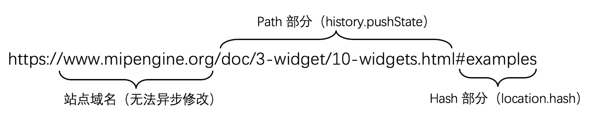
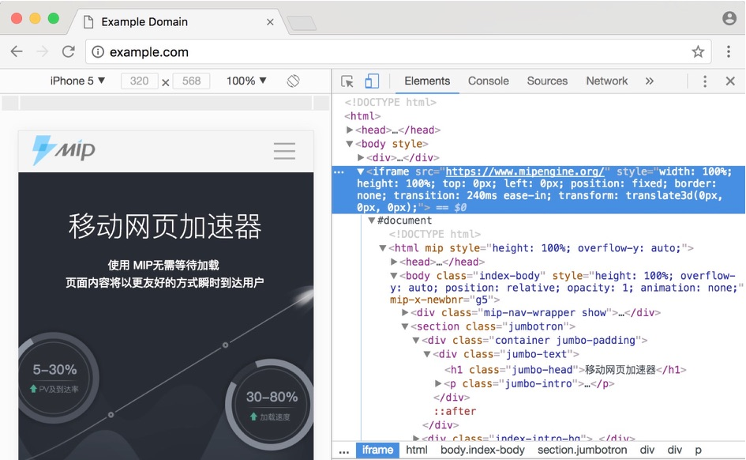

# 类原生的 MIP 页面体验

在传统 Web 技术中，页面之间的切换可能带来白屏、卡顿、等待进度条等不友善的体验。相比之下，原生应用的页面切换更为流畅顺滑，且带有丰富的交互效果。而使用MIP 技术，可以方便地让页面获得媲美原生应用的页面访问体验。

## 单页异步原理

从 JavaScript 被发明开始，人们就在研究如何在不刷新的基础上更新网页。AJAX 技术的出现，使得前端脚本有能力加载服务端数据，这样一来就可以通过数据来指导更新页面了。然而，由于 JavaScript 无法保存更新过后的状态，用户只要刷新或是收藏，在日后重新打开，修改后的页面都不复存在。因此，在页面更新后，我们需要将该状态在地址栏中持久化。

如下图所示，一个简单的 URL，分为三大部分：站点域名、Path 和 Hash。其中，站点域名标识一个站点的服务器地址，这无法通过前端代码进行非刷新的修改；而另外两部分，均可在前端进行修改。下面将介绍如何异步无刷新地修改 URL。

一种简单且实用的方式是使用 URL Hash(即 URL中 `#` 符号后的部分)，通过 `location.hash` API 可以简单地修改 hash 而不触发页面刷新，使得前端有能力在不刷新的情况下修改 URL。但根据URL标准，URL Hash 被视为「锚点」，不会发送到浏览器。因此，使用这类技术加载的页面，通常需要前端渲染，从而使得加载过于缓慢。

为了解决这些问题，从 HTML5 开始，我们有了新的 API：`history.pushState`。通过 pushState API，前端脚本得以改变地址栏中的 URL 而无需刷新页面。同时，在用户刷新时，还可将修改后的 URL 发送到服务端。此外，还可以通过 `history.replaceState` 替换当前历史记录，从而抛弃冗余的历史记录。

`history.pushState` 或是 replaceState 同样都接收三个参数，分别是：状态对象、网页标题和需要替换的目标 URL。

例如，`http://example.com/foo.html` 的前端脚本执行了 `history.pushState({}, "title", "bar.html")`，地址栏的 URL 会立即变成 `http://example.com/bar.html`，而此时浏览器并不会请求 `/bar.html`，该网页甚至可以不存在。这使得我们可以轻松地实现前端单页异步应用，因此，pushState API 被视为是现代浏览器中开发单页异步的最佳实践。

## 打开 MIP 页面

无论你是站长，或是搜索引擎，亦或是导航站点，你可能都需要在自己现有的页面上加载一个 MIP 页面。通过 `<iframe>` 标签加载是一种十分简单的方式，而 MIP 可以在 iframe 容器中工作良好。

如下图所示，这里在 example.com 域名打开了一个 MIP 官网。图中我们可以看到，以 iframe 形式加载的 MIP 页面，和普通页面体验一致。

在创建 iframe 的基础上，加入 CSS3 实现的进场、退场动画，可以增强用户体验。

在上述代码中，我们制作了一个进场动画，然后在三秒后展示退场动画。由于书中无法演示动画效果，你可以在 Chrome DevTools 的 Consoles 中粘贴上述代码，在你的电脑上看到这个动画效果。

## 与 MIP 页面通信

受制于浏览器安全策略，外部无法直接通过脚本操作 iframe 内部的网页元素，所以需要通过 postMessage 在 iframe 内外传递消息。为了保证 MIP 页面的安全，外部页面向 MIP 页面内部发送的所有消息都会被忽略，但 MIP 页面会向外传递有限的信息，外部可通过这些信息获取MIP页面的状态和请求。
要查看 MIP 页面向外发送的消息，你需要在 `window` 上监听 `onmessage` 事件。

制作加载中提示
在 `MIP` 加载过程中，会触发 `mippageload` 事件，能告诉你 MIP 页面已经加载完成了。于是，在之前的代码基础上，我们可以增加一个简单的「加载中」提示。
可以保证在加载完成之前，一直有「**加载中**」的字样，直到页面加载完成后才消失，如下图所示。

## 处理 MIP 页面间跳转

在 MIP 页面中使用 `<a mip-link href="____">` 的形式，可以创建 MIP 页面跳转的效果。如果使用自行实现的 MIP 页面打开，也需要自行实现这样的跳转。该跳转使用 `postMessage` 传递 loadiframe 事件。
