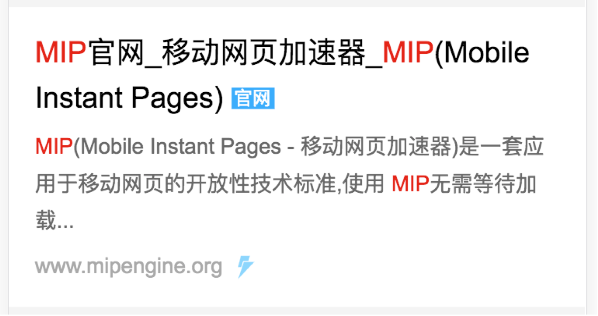
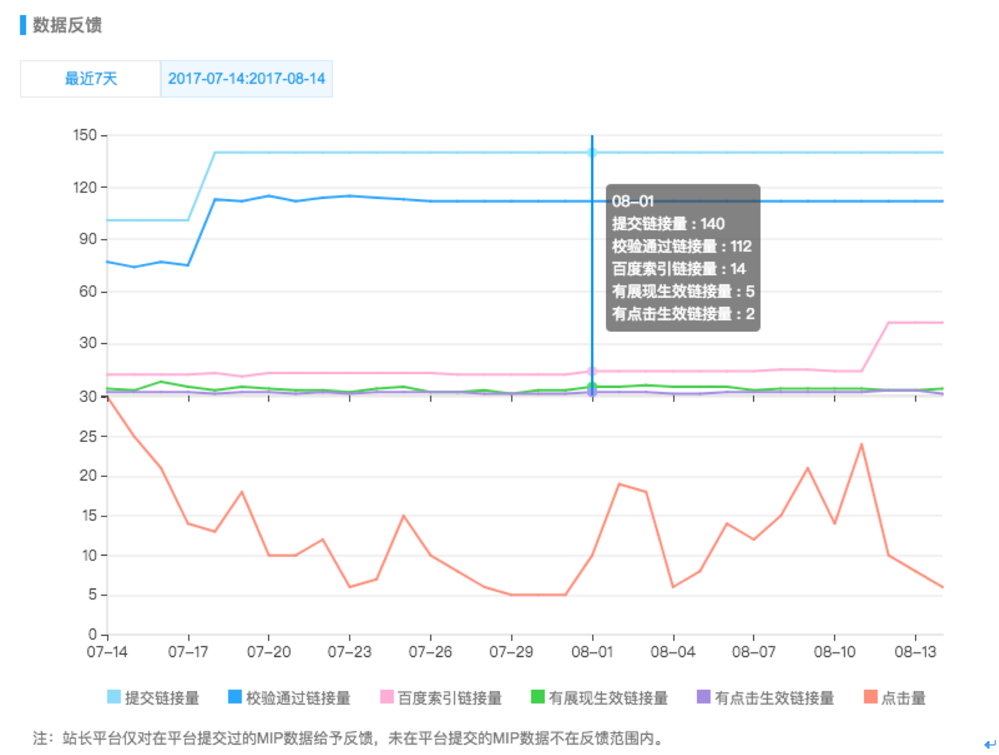
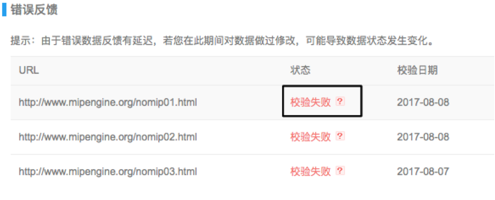

# MIP 搜索生效流程

当搜索引擎发现 MIP 页之后，会进入一系列收录校验流程，确认合法后的 MIP 页即可生效。

## MIP 搜索生效通用流程

一条 MIP URL 在搜索引擎生效的过程中，需要经历以下流程。

1. 蜘蛛抓取：蜘蛛抓取站长主动提交的 URL，或搜索引擎自动发现 URL；
2. MIP 规范校验：校验 URL 是否符合 MIP 规范；
3. 建索引：根据网页质量特征来筛选页面，将高质量页面存入索引，参与排序；
4. 对应关系挖掘：根据 canonical 标识的对应关系，以及网页的相似度，将 MIP 和 H5 对应起来；
5. 搜索展现：在搜索结果页中，MIP 页替换对应 H5 页展现，承接搜索流量；
6. 搜索生效：网页被认证为合法 MIP 页，用户点击页面时，能感受到使用 MIP-Cache 加速效果，以及其他加速策略。

值得注意的是「MIP 规范校验」对「搜索展现」和「搜索生效」的影响。不能通过 MIP 校验的 URL 也有可能进入索引，与对应的 H5 页进行权重转移，最终在搜索结果页展现。但由于不是合法 MIP 页，不会占用 MIP-Cache 缓存资源，不算作搜索生效。

## MIP 在百度搜索生效的流程

在上面提到的步骤中，百度搜索针对第 6 步增加了体验优化的加速策略。具体表现为：在结果链接后出现闪电标，点击这条结果，落地页从右侧以动画效果滑入。百度搜索的闪电标样式如下图所示。

除此之外，在搜索结果页预加载 `mip.js`，预取用户可能点击的 MIP 页，也能够减少资源加载时间，加快打开速度。

### MIP 在百度生效的进度反馈

MIP URL 的生效进度，在百度搜索资源平台 ([https://ziyuan.baidu.com/mip/index](https://ziyuan.baidu.com/mip/index)) 数据提交中可以看到，如下图所示。

### MIP 在百度生效的常见问题分析

理想情况下，提交了 100 条 URL，就应该生效 100 条。但事实上，因为受各种因素影响，生效缓慢，或生效比例低。以上图中 2017 年 9 月 1 日的数据为例，提交 140 条，仅有 14 条进入索引，最终有 2 条点击生效。生效量低，可能是以下几个原因造成的。

#### 提交抓取有限额

原因：如果要提交的 URL 较多，超过一天的限额，则需要分多天提交。有可能出现第一天提交的 URL 已经生效，但还有 URL 未提交的情况。(注：推送限额由网站本身能够承受的抓取强度决定，对于刚注册的站点，限额为每天 1 万条)

解决方案：

- 优先提交质量高，点击量高的与 H5 对应的 MIP 页，这样初期提交生效效果会更加明显；
- 提高限额：在确认网站能够承受的前提下，从百度站长平台提交反馈，短时间提高提交抓取限额。

#### 校验通过量低

原因：MIP URL 页面前端代码不符合 MIP 规则，不能通过校验。
解决方案：根据 `百度资源平台` -> `MIP 引入` 的报错信息(如下图所示)，使用 MIP 校验工具修改页面代码，等待再次抓取即可。

#### 进入索引链接量低

原因：有选择地建立索引是搜索引擎的策略，改造 MIP 不能够保证一定进入百度搜索的索引。
在理想条件下，整个互联网的所有网页资源都应该被搜索引擎收录。但是，现实情况是互联网上的资源质量不等，搜索引擎的抓取资源和存储资源都有限，因此，需要择优索引。
解决方案：从以下角度考虑，提交高质量，有内容的页面。

- 页面的受众，即有多少用户会去关注这个页面的话题。
- 页面本身的质量，即页面是否可以正常打开，主要功能部分是否完整并可以使用。修改 MIP，使用 MIP 提供的官方组件，能够使页面较好满足本条要求。
- 页面描述的内容是否完整，清晰；内容和主题是否吻合；内容丰富度如何。
- 资源稀缺情况，即是否有较多的可替代资源。

#### 对应关系挖掘失败

原因：MIP 页面 canonica l标签填写有误，或 MIP 与 H5 内容相似度低。
解决方案：

- 正确填写 canonical 标签：如果 MIP 页有对应的 H5 页，需要填写正确的 canonical 对应关系。详见 MIP官网文档。
- 保证内容相似度：如果文章内容不同，搜索引擎会否认 MIP 与 H5 的对应关系。保证内容完全一致，样式大体相同，才能通过相似度校验。

#### 有展现生效链接量低

原因：主要因为用户没有搜到页面关键词，或页面排序靠后，MIP页没有被用户看到。
解决方案：

- 继承权重：MIP 页会继承对应 H5 页的权重，替换 H5 页出现。如果 MIP 页有对应的 H5 页，需要填写正确的 canonical 对应关系。
- 提升权重：从页面打开速度、内容相关性、内容权威性、内容原创性、用户浏览体验几个方面优化页面。
