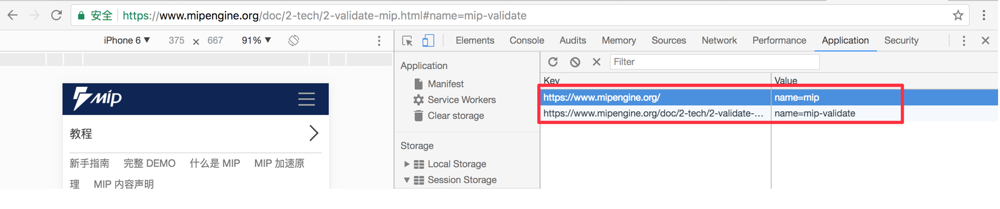
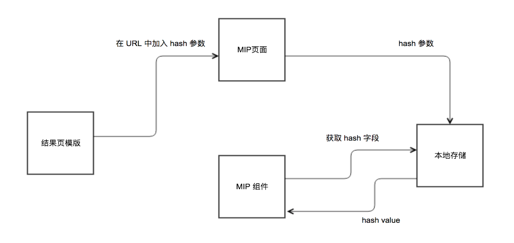

# hash 通信机制

从搜索结果页点出的 MIP 页面是被镶嵌在一个 iframe 中的，在很多情况下其实我们是需要从上层页面传递参数给 iframe页面的，那么如何进行消息传递，如何保持消息的时效性将成为本节要探讨的一个重点。

## 为什么选择 hash

一提到消息的传递，很多开发者可能都能列举出很多种方法，如 Post Message、URL Query、URL hash 等。MIP 目前采用 hash 的方式来进行消息传递，那么 hash 传递有什么好处呢？可以归结为以下几点。

- 消息单向传递：在任何需要使用的时机，只需要通过hash来获取参数即可，不需要进行双方的通信确认。
- 实现成本低：在需要加入传递信息时，只需要在URL中拼接对应 hash 参数即可。

## hash + sessionStorage

MIP 的 hash 通信方案是结合 sessionStorage 来做的。以当前页面 URL 为 key，以 hash 为 value 进行存储，如下图所示：


那么为什么选用 session storage 呢？相信读到这里很多开发者已经想到了原因，当然基于 session storage 的作用域特性，我们希望在当前页面环境中能够使用到正确的 hash 值，但不希望带来持久性的存储导致用户设备空间的消耗，并且能够在刷新页面后能够保持所需要的数据，所以 session storage 当然是不二之选。

## 实现原理



如上图所示，MIP hash 通信机制的完成可以分为这样几个步骤。

1. 三方业务将需要进行通信的参数加入到 MIP 页面 URL 的 hash 中。
2. 在 MIP 运行环境加载完成之后，会将 URL 中的参数存储在 session storage 中，并在内存中保存 hash 解析后的键值对对象。
3. 当组件中需要使用时只需要通过 MIP 提供的 `MIP.hash.get` API 即可拿到参数，如下面代码所示。

```js
get(key) {
  //在hash对象中获取对应 key的hash 值
  let hv = this.hashTree[key]
  return hv && hv.value ? hv.value : ''
}
```
