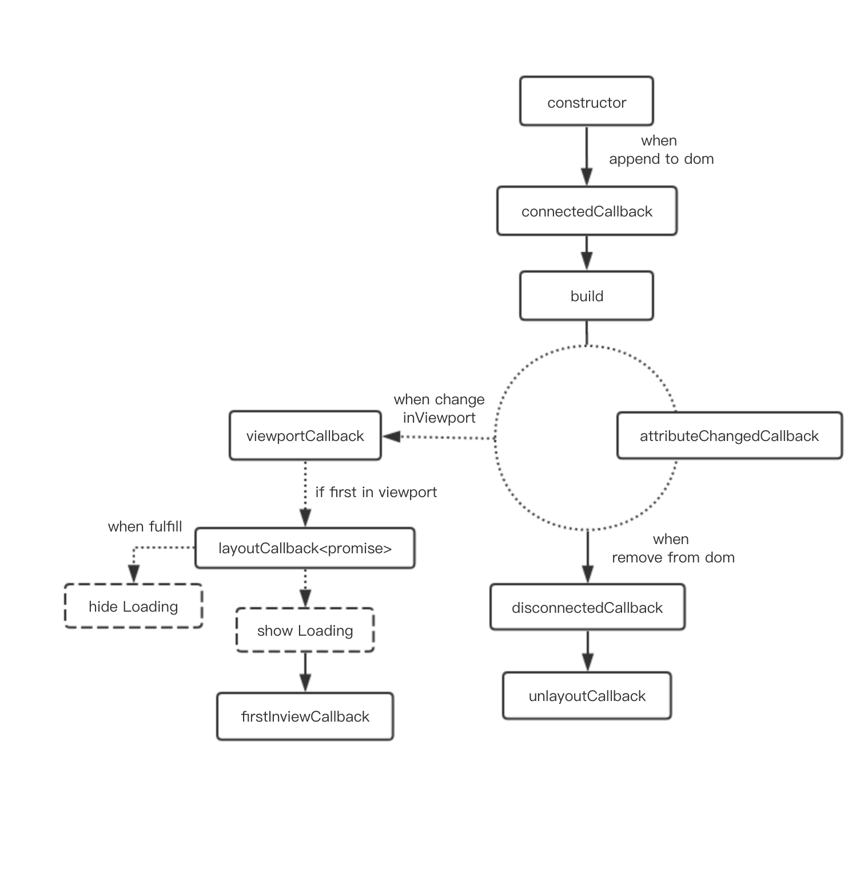

# MIP 组件实例的生命周期和回调钩子

## 创建一个简单的 mip 组件

为了提升 mip 组件的开发效率，我们允许开发者使用 vue 开发 mip 组件，然后通过 mip-cli 工具编译成 mip 组件，下面是代码一个 mip 组件示例：`mip-example`。

```js
import './mip-example.less'

export default class MIPExample extends MIP.CustomElement {

  layoutCallback() {
    // 如果在 layout 展现后需要进行异步操作，如：加载资源
    // 返回 promise
    return fetch('/some/resource/path')
  }

  firstInviewCallback() {
    console.log('第一次进入视口')
  }

  connectedCallbacl() {
    console.log('挂载到 DOM')
  }

  build() {
    this.innerHTML = '<h1>MIP 2.0 component example</h1>'
  }

  disconnectedCallback() {
    console.log('移出了 DOM')
  }
  // ...
}
```

然后使用 mip-cli 工具编译打包后核心内容大概是这样的：

```js
// 创建 style 标签，将 mip-example.less 编译的 css 内容放入 style，并为 css 加上 scope

// 注册自定义组件
MIP.registerElement(
  'mip-example',
  implementation // custom element 对象
);
```

## 组件实例生命周期

你可以定义以下的生命周期回调钩子,这些回调会在自定义元素的生命周期的不同点回调。

### connectedCallback

- 类型：Function
- Context: CustomElement
- 详细：
    自定义元素的生命周期钩子，元素挂载到 DOM 上之后执行。

### build

- 类型：Function
- Context: CustomElement
- 详细：
    自定义元素的生命周期钩子，开始渲染组件。

### viewportCallback

- 类型：Function
- Context: CustomElement
- 详细：
    自定义元素的生命周期钩子，元素进入或者离开视窗的时机。

### layoutCallback

- 类型：Function
- Context: CustomElement
- 返回
  - Promise
- 详细：
    自定义元素的生命周期钩子，元素 layout 渲染完成的时机（保证了无抖动环境），该回调函数的返回值须为 Promise，主要用来处理一些异步耗时的操作，如资源的加载，复杂的渲染等。

### firstInviewCallback

- 类型：Function
- Context: Custom Element 组件实例
- 详细：
    自定义元素的生命周期钩子，在元素挂载到 DOM 上之后，首次出现在视口内上时执行。适合做懒加载之类的功能。

### disconnectedCallback

- 类型：Function
- Context: CustomElement
- 详细：
    自定义元素的生命周期钩子，元素从 DOM 上移除之后执行。

### unlayoutCallback

- 类型：Function
- Context: CustomElement
- 详细：
    自定义元素的生命周期钩子，元素从资源管理队列中移除（删除 dom）的时候被调用。

### 生命周期图示

为了更好的展示 mip 的生命周期的具体流程，下图是 mip 组件实例的生命周期的示意图，展示了每个生命周期钩子的执行时机。


